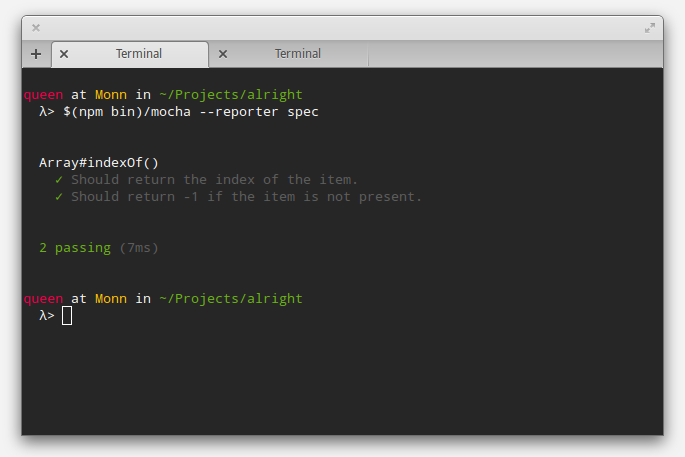

=================
 Getting Started
=================

This document will guide you through the basics of Alright. This is a quick
introduction, but once you finish this page you'll know all you need to start
writing assertions for your code-base.

What is Alright?
================

Alright is a library that provides ways of asserting properties about pieces of
data in JavaScript without verbosity, and in a way that it can be easily
extended to support specific type of assertions. It also provides `Sweet.js`_
macros for writing concise assertions.

For example::

    2 + 2 => 4
    [1, 2, 3] should have('foo')

Okay, cool. Where do I start?
=============================

In this tutorial we're going to use Alright together with `Node.js`_, `Mocha`_,
and `Sweet.js`_ to write some tests. The process is pretty similar to all other
platforms, and we show how to make things work in the browser at the end.

So, first things first, once you've got `Node.js`_ installed, you'll want to
start a new project and run the following commands:

.. code-block:: sh

   $ mkdir test-project
   $ cd test-project
   $ npm install sweet.js alright mocha

Writing assertions
==================
   
With all in place, we're ready to create our first test script. Make a file
``test/array.sjs`` with the following contents::

    // The only requirement is that you have `alright` in your
    // scope for the macros to work.
    var alright = require('alright')

    describe('Array#indexOf()', function() {
      it('Should return the index of the item.', function() {
        [1, 2, 3].indexOf(2) => 1
      })

      it('Should return -1 if the item is not present.', function() {
        [1, 2, 3].indexOf(4) => -1
      })
    })

As you see, assertions are written in using the form: ``expression => expected``,
where ``expression`` is any computation for the value you want to test, and
``expected`` is the value you expect to get as result. The values are compared
structurally, which means that ``[1, 2, 3] => [1, 2, 3]`` will succeed, for
example. You can use ``expression => not expected`` to invert the expectation,
so ``2 => not 1`` will succeed.

The keen JavaScripter might have noticed that we're not quite writing
JavaScript here, so first we need to turn this script into something a JS
engine (in this case, Node's v8) will understand. This is where the ``sjs``
compiler we've installed (through ``sweet.js``) comes in. It takes a ``.sjs``
file, some macro definitions (which do tell the compiler how the magic should
be done), and gives us JavaScript as we know it:

.. code-block:: sh

   $ $(npm bin)/sjs --module alright/macros -o test/array.js test/array.sjs

.. note::

   The ``$(npm bin)`` command allows one to get the path where local binaries are
   installed with *npm*, so you can use it to keep all of your dependencies
   localised instead of installing them globally.

Finally, we just need to run the test through Mocha:

.. code-block:: sh

   $ $(npm bin)/mocha --reporter spec

Should all go well, you'll see the following output:

.. note:: 

   If you're not using any build system, you can get *npm* to help you with
   automating this compiling/testing phase. Just put whatever you'd write in
   the command line inside of your ``package.json``'s ``script`` section. You
   can even leave out the ``$(npm bin)`` part, since *npm* searches inside that
   folder automagically::

       {
         ( ... )
         "scripts": {
           "test-cc": "sjs -m alright/macros -o test/array.js test/array.sjs",
           "test": "npm run test-cc && mocha --reporter spec"
         },
         ( ... )
       }

Complex assertions
==================

The most straight forward way of making assertions is the structural equality
assertion (``=>``), but sometimes you're interested in other properties as
well. There are so many possibilities of properties you can come up with that
it doesn't make sense to come up with a special symbol for every one of
them. So, instead, Alright allows you to provide a validation function.

Many validations are built right into Alright itself. In fact, the structural
equality assertion is just a special case of this::

    [1, 2] => [1, 2]
    // Is the same as:
    [1, 2] should alright.equal([1, 2])

Since they're just regular functions, you can always write your own::

    function beGreater(expected){ return function(actual) {
      var divergence = alright.divergence.invertibleDivergence(
        '{:actual} to be greater than {:expected}'
      , '{:actual} to not be greater than {:expected}'
      )

      return alright.assert( actual > expected
                           , divergence.make({ actual  : actual
                                             , expected: expected }))
    }}
    
    3 should beGreater(2)

Other platforms
===============

The same concepts explained here apply to all other JavaScript platforms, but
if you're not using a platform that has direct support for Node modules, you'll
want to use the UMD bundle (the single file that can be used in any platform,
and any module system!). The easiest way of doing so is `downloading the latest
release`_ and loading the ``alright.umd.js`` in your platform:

Common JS:

    .. code-block:: js

       var alright = require('alright')
       ( ... )

AMD:

    .. code-block:: js

       require(['alright'], function(alright) {
         ( ... )
       })

Browser without a module system:

    .. code-block:: html

       
       

Using Alright without macros
============================

If you don't want to use Sweet.js macros, you can use alright's testing
functions directly. Just use the ``verify`` function to throw an exception if
an expectation isn't met::

    var _ = alright

    _.verify( _.equals(1)(1) )          // same as: 1 => 1

    _.verify( _.not(_.equals(1)(1)) )   // same as: 1 => not 1

Where to go from here?
======================

Now that you get the idea behind Alright, you can start writing your assertions
for testing your JavaScript code. Be sure to check out the :doc:`Discover
Alright <../user/index>` documentation to learn everything you can get from the
library.

.. _Sweet.js: http://sweetjs.org/
.. _Node.js: http://nodejs.org/
.. _Mocha: http://visionmedia.github.io/mocha/
.. _downloading the latest release: https://github.com/robotlolita/alright/releases/download/v1.0.0/alright-1.0.0.tar.gz
